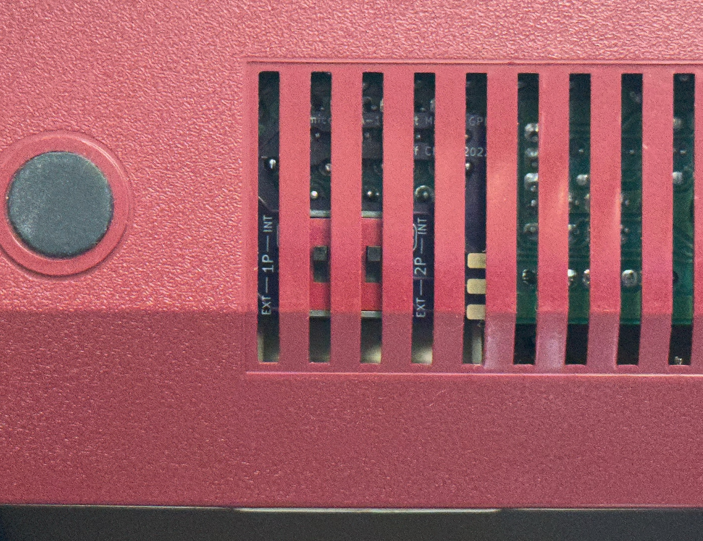

# Famicom Expansion Port Switcher Mod

The expansion port on the Japanese Famicom consoles have a problem - many North American games are incompatible with the controllers connected to this port, due to the fact that this expansion port did not exist on the NES.

I created the [FamiCoun](https://github.com/jeffqchen/FamiCoun-Famicom-Front-Expansion-NES-SNES-Adapter) and the [TwinDiamond](https://github.com/jeffqchen/TwinDiamond-Twin-Famicom-Expansion-to-NES-SNES-Controller-Adapter) a few years ago and both suffered from this design oversight by Nintendo. So it is natural for me to take matters into my own hands to fix it.

This switcher mod will enable you to switch the role of the expansion controllers between internal and external. It requires experience in console modding and might not be friendly for everybody. Please keep this in your mind before attempting.

Details are provided in the Wiki, separated by console models and motherboard revisions.

-----
## Special Thanks
Voultar (for insisting on a proper logic circuit implementation)
- [Twitter](https://twitter.com/Voultar)

Redherring32 (for providing the board scan of Famicom GPM for reference)
- [Twitter](https://twitter.com/redherring32)
-----

Shield: [![CC BY-SA 4.0][cc-by-sa-shield]][cc-by-sa]

This work is licensed under a
[Creative Commons Attribution-ShareAlike 4.0 International License][cc-by-sa].

[![CC BY-SA 4.0][cc-by-sa-image]][cc-by-sa]

[cc-by-sa]: http://creativecommons.org/licenses/by-sa/4.0/
[cc-by-sa-image]: https://licensebuttons.net/l/by-sa/4.0/88x31.png
[cc-by-sa-shield]: https://img.shields.io/badge/License-CC%20BY--SA%204.0-lightgrey.svg
